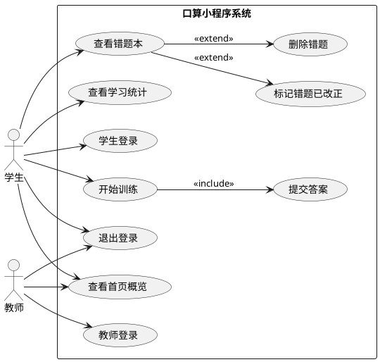

# 实验5：口算小程序用例分析

## 1. 系统概述

本实验以当前的“小学数学口算分级训练小程序”为对象，采用面向对象分析方法，围绕系统中的参与者和主要业务目标进行用例建模。

系统主要支持以下业务：

- 学生/教师登录
- 学生按难度与题型开始口算训练
- 自动判题与结果反馈
- 错题本管理
- 学习统计查看
- 退出登录

## 2. 系统边界与参与者

### 2.1 系统边界

系统边界为“口算小程序系统”，包含前端小程序与后端服务提供的训练、错题、统计和认证能力。

### 2.2 参与者

- 学生：系统的主要使用者，完成登录、训练、查看错题、查看统计等操作。
- 教师：可使用教师账号登录系统，进入首页查看系统信息。

## 3. 系统用例图

如果你要直接用本地 PlantUML 应用渲染，把这一段保存为 `.puml` 文件即可。

## 4. 用例文档

### 用例 1：学生登录

- 用例编号：UC-01
- 主要参与者：学生
- 目标：学生使用账号和密码登录系统，进入首页。
- 前置条件：学生已拥有账号。
- 后置条件：系统保存登录态，学生可访问训练、错题和统计页面。
- 基本流程：
  1. 学生打开小程序登录页。
  2. 输入账号和密码。
  3. 系统校验输入是否合法。
  4. 系统向后端发送登录请求。
  5. 后端验证身份并返回 token 和用户信息。
  6. 系统保存登录态并跳转首页。
- 备选流程：
  - A1：账号或密码为空，系统提示补充输入。
  - A2：账号或密码错误，系统提示登录失败。

### 用例 2：教师登录

- 用例编号：UC-02
- 主要参与者：教师
- 目标：教师使用教师账号登录系统。
- 前置条件：教师已拥有账号。
- 后置条件：系统保存教师登录态，教师可进入首页。
- 基本流程：
  1. 教师在登录页切换到教师身份。
  2. 输入账号和密码。
  3. 系统发送教师登录请求。
  4. 后端验证身份并返回 token 和用户信息。
  5. 系统保存登录态并跳转首页。
- 备选流程：
  - A1：身份切换错误或账号密码不合法，系统提示重新输入。
  - A2：认证失败，系统提示账号或密码错误。

### 用例 3：查看首页概览

- 用例编号：UC-03
- 主要参与者：学生、教师
- 目标：用户进入首页后查看当前账号信息与快捷入口。
- 前置条件：用户已登录。
- 后置条件：系统展示首页信息。
- 基本流程：
  1. 用户进入首页。
  2. 系统读取本地登录态。
  3. 学生角色下，系统请求学习摘要并展示等级、正确率、今日题数等信息。
  4. 系统展示训练、错题本、统计等快捷入口。
- 备选流程：
  - A1：未检测到登录态，系统跳转登录页。
  - A2：摘要加载失败，系统提示加载异常。

### 用例 4：开始训练

- 用例编号：UC-04
- 主要参与者：学生
- 目标：学生按指定难度和题型开始口算训练。
- 前置条件：学生已登录。
- 后置条件：系统生成题目列表，进入答题状态。
- 基本流程：
  1. 学生进入训练页。
  2. 选择难度、题型和题目数量。
  3. 系统向后端请求生成题目。
  4. 后端返回题目列表。
  5. 系统按顺序展示题目并启动计时。
- 备选流程：
  - A1：题目列表为空，系统提示更换难度或题型。

### 用例 5：提交答案并判题

- 用例编号：UC-05
- 主要参与者：学生
- 目标：学生提交单题答案，系统自动判定正误并返回结果。
- 前置条件：训练已开始，当前题目已展示。
- 后置条件：系统记录答题结果，必要时更新等级和正确率统计。
- 基本流程：
  1. 学生输入答案。
  2. 系统校验答案不能为空。
  3. 系统向后端提交答案和答题耗时。
  4. 后端进行判题并返回结果。
  5. 系统显示对错、标准答案、得分和升级信息。
  6. 学生继续下一题或结束本次训练。
- 备选流程：
  - A1：未输入答案，系统提示先输入答案。
  - A2：接口请求失败，系统提示稍后重试。

### 用例 6：查看错题本

- 用例编号：UC-06
- 主要参与者：学生
- 目标：学生查看历史错题并按状态筛选。
- 前置条件：学生已登录。
- 后置条件：系统展示错题列表及其状态。
- 基本流程：
  1. 学生进入错题本页面。
  2. 系统加载错题列表。
  3. 学生可按“全部 / 未改正 / 已改正”进行筛选。
  4. 系统展示题干、错误次数、正确答案等信息。
- 备选流程：
  - A1：当前没有错题，系统显示空状态提示。

### 用例 7：标记错题已改正

- 用例编号：UC-07
- 主要参与者：学生
- 目标：学生将已掌握的错题标记为“已改正”。
- 前置条件：错题本中存在未改正题目。
- 后置条件：错题状态更新为已改正。
- 基本流程：
  1. 学生在错题详情中点击“标记改正”。
  2. 系统弹出确认对话框。
  3. 学生确认后，系统发送更新请求。
  4. 后端更新错题状态。
  5. 系统刷新列表。
- 备选流程：
  - A1：学生取消确认，系统不做修改。

### 用例 8：删除错题

- 用例编号：UC-08
- 主要参与者：学生
- 目标：学生删除不再需要保留的错题记录。
- 前置条件：错题本中存在目标错题。
- 后置条件：错题记录被删除。
- 基本流程：
  1. 学生在错题详情中点击删除。
  2. 系统弹出删除确认框。
  3. 学生确认后，系统发送删除请求。
  4. 后端删除错题记录。
  5. 系统刷新错题列表。
- 备选流程：
  - A1：学生取消删除，系统保持原状态。

### 用例 9：查看学习统计

- 用例编号：UC-09
- 主要参与者：学生
- 目标：学生查看总览、最近20题、每日统计和题型分析。
- 前置条件：学生已登录。
- 后置条件：系统展示学习统计结果。
- 基本流程：
  1. 学生进入统计页。
  2. 系统并行请求学习摘要、最近20题和近7天统计数据。
  3. 系统展示累计正确率、当前等级、最近20题正确率等信息。
  4. 学生切换查看不同统计视图。
- 备选流程：
  - A1：数据加载失败，系统提示网络或服务异常。

### 用例 10：退出登录

- 用例编号：UC-10
- 主要参与者：学生、教师
- 目标：用户主动退出当前账号。
- 前置条件：用户已登录。
- 后置条件：系统清除本地登录态并返回登录页。
- 基本流程：
  1. 用户点击退出登录。
  2. 系统弹出确认对话框。
  3. 用户确认后，系统调用后端登出接口。
  4. 系统清除本地 token、用户信息和角色信息。
  5. 系统跳转至登录页。
- 备选流程：
  - A1：用户取消退出，系统停留在当前页面。

## 5. 小结

从面向对象分析角度看，本系统的核心对象围绕“用户、题目、答题记录、错题记录、学习统计”展开。通过用例图和用例文档可以清晰描述系统参与者、目标和业务流程，为后续类图、时序图和数据库设计提供基础。